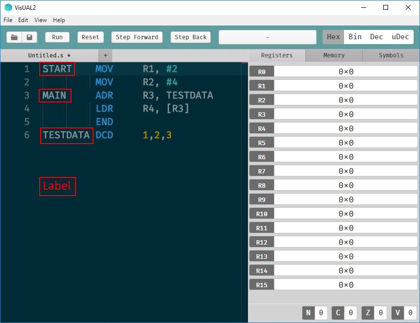

# ARM UAL Guide

## Syntax

Each assembly source line consists of *words* separated by whitespace, `,` or `;`. Additional spaces or tabs between or before words are ignored. Unlike many assemblers initial space has no significance. Each line starts, optionally, with a label. If the second word is a valid op-code then the first word will be interpreted as a label, otherwise it must be an op-code.


```
[Label] OPCODE operand1, ... , operandn [ ; comment ]
```


### [Data Processing Instructions](https://tomcl.github.io/visual2.github.io/data-processing.html)

### [Single Memory Transfer Instructions](https://tomcl.github.io/visual2.github.io/memory-transfer.html)

### [Multiple Register Memory Transfer Instructions](https://tomcl.github.io/visual2.github.io/multiple-register-transfer.html)

### [Pseudo instructions and directives](https://github.com/tomcl/visual2.github.io/blob/master/list.md#pseudo-instructions-and-directives)

### [Full Instruction List](https://tomcl.github.io/visual2.github.io/list.html#instructions)

### [Instruction Conditions](https://github.com/tomcl/visual2.github.io/blob/master/conditions.md)

## Introduction



The picture above is a screenshot of VisUAL2 editing an **assembler program** containing lines 1 - 6 of text. These lines define part of an ARM CPU's initial memory. Lines (1 - 4) have ARM instruction op-codes and each represent a single ARM instruction. The instructions, each stored as one word of memory, define the contents of a **code memory area**, starting from memory address 0. Line 6 has an data definition op-codes `DCD` and defines data locations used by the program which are placed automatically in memory addresses after the code area. 

Any line can be **labelled** with a symbol (annotated in red on the screenshot) that references the memory address into which the line is placed. For advanced users `EQU` lines can define additional symbols. Programmers use symbols in instructions and therefore the memory addresses into which each line of assembler is placed are not normally needed when writing programs. They can be checked by using the symbols tab of the right-hand panel in VisUAL2 after a program has run.

When writing assembler programs you can use instructions (executed sequentially) that refer to data locations you have defined using labels or numeric addresses, or that read and write uninitialised data memory you have not defined.

The VisUAL simulator emulates an ARM CPU by sequentially executing instructions. A single assembler file will always start from the first defined instruction in the file. Simulation terminates at the last instruction line of the file, or if an `END` line (5 here) is executed.

The current assembler program can be simulated either in whole or step-by-step using the VisUAL top bar buttons. During simulation the simulated content of CPU registers is displayed in the right-hand window. For more complex usage tabs also allow you to see the contents of memory, and the values assigned to program symbols.
